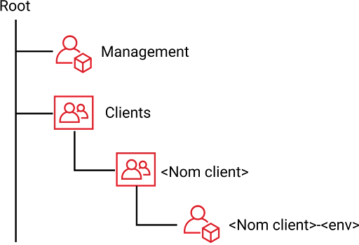
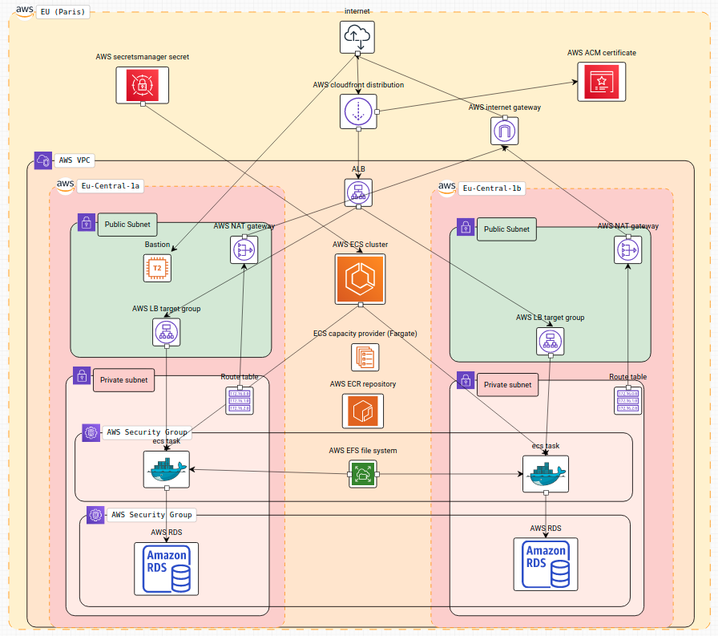

# Aws Architecture with Terraform

## Sommaire de la documentation
- [Installation des prérequis pour terraform](docs/1_install_prerequisites.md)
- [Configuration des secrets de l'application](docs/2_create_secrets.md)
- [Déploiement de l'infra](docs/3_deploy_infra.md)
- [Préparer le cronjob pour le déploiement](docs/4_prepare_cronjob.md)
- [Déploiement du backend](docs/5_deploy_backend.md)
- [Déploiement du frontend](docs/6_deploy_frontend.md)
- [Analyse des coûts de l'infra](docs/7_finops.md)

## Tutos
- [Manipuler terraform](docs/tutos/terraform.md)
- [Manipuler la console AWS](docs/tutos/aws.md)
- [Se connecter au VPN](docs/tutos/vpn.md)

## Schéma de l'organization créée sur AWS

  

## Schéma de l'application déployé sur AWS

  

