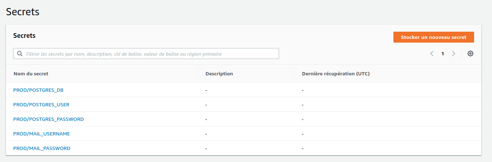
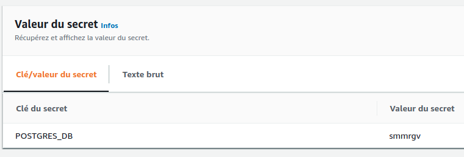

# Configuration des secrets de l'application

Afin de pouvoir lancer l'application sur AWS de façon sécurisée, nous positionnons tous les secrets dans le Secret Manager d'AWS. De cette façon aucune donnée sensible n'est affiché en clair nul part (git, aws ...)

Pour chaque environnement il faudra donc créer les secrets suivants dans la même region et compte que les ressources de compute de l'application :

<p align="center">
  
</p>

```bash
PROD/POSTGRES_DB
PROD/POSTGRES_USER
PROD/POSTGRES_PASSWORD
PROD/MAIL_USERNAME
PROD/MAIL_PASSWORD
```

Chacun de ces secrets doit être du type "Autre type de secrets". Et doivent contenir EXACTEMENT une clé dans ce genre :

<p align="center">
  
</p>

```bash
# Exemple pour le secret ayant le nom PROD/POSTGRES_DB

# Clé/valeur du secret
Clé    : POSTGRES_DB
Valeur : <Valeur secrète>
```
