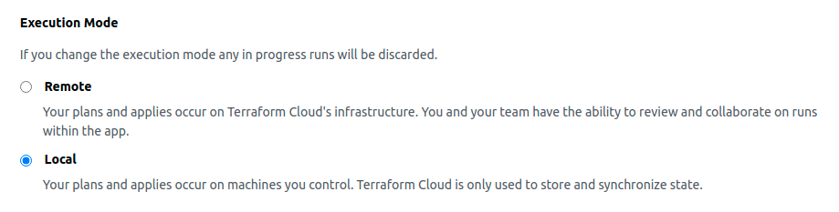

# Déploiement du frontend

Une fois le socle du frontend déployé, il faut maintenant installer le frontend en tant que service dans le cluster ECS.

Pour ce faire, voici les étapes à suivre :

## 1) Builder et pusher l'image du frontend sur AWS ECR

Se rendre dans le repo du frontend puis lancer les commandes suivantes :

```bash
export NAMESPACE=companyName
export AWS_ACCOUNT_ID=452185648521
export AWS_ACCESS_KEY_ID=<YOUR AWS ACCESS KEY ID>
export AWS_SECRET_ACCESS_KEY=<YOUR AWS SECRET KEY ID>
export AWS_REGION=eu-west-3
export STAGE=prod
export IMAGE_TAG=1.0.3
aws sts assume-role --role-arn "arn:aws:iam::${AWS_ACCOUNT_ID}:role/OrganizationAccountAccessRole" --role-session-name AWSCLI-Session > assume_role_creds.json

# Le contenu du fichier assume_role_creds.json doit ressembler à ceci
# {
#    "Credentials": {
#         "AccessKeyId": "XXXXXXXXXXXXXXXXXXXXXXX",
#         "SecretAccessKey": "XXXXXXXXXXXXXXXXXXXXXXXXXXXXXXXXXXXXXXX",
#         "SessionToken": "XXXXXXXXXXXXXXXXXXXXXXXXXXXXXXXXXXXXXXXXXXXXXXXXXXXXXXXXXXXXXXXXXXx==",
#         "Expiration": "2021-08-23T10:55:02+00:00"
#     },
#     "AssumedRoleUser": {
#         "AssumedRoleId": "AROAVJS3ZDFZF5ATOETK5:AWSCLI-Session",
#         "Arn": "arn:aws:sts::452185648521:assumed-role/OrganizationAccountAccessRole/AWSCLI-Session"
#     }
# }

export AWS_ACCESS_KEY_ID=$(cat assume_role_creds.json | jq --raw-output '.Credentials.AccessKeyId')         # "<Credentials.AccessKeyId du fichier assume_role_creds.json>"
export AWS_SECRET_ACCESS_KEY=$(cat assume_role_creds.json | jq --raw-output '.Credentials.SecretAccessKey') # "<Credentials.SecretAccessKey du fichier assume_role_creds.json>"
export AWS_SESSION_TOKEN=$(cat assume_role_creds.json | jq --raw-output '.Credentials.SessionToken')     # "<Credentials.SessionToken du fichier assume_role_creds.json>"

aws ecr get-login-password --region $AWS_REGION | docker login --username AWS --password-stdin $AWS_ACCOUNT_ID.dkr.ecr.$AWS_REGION.amazonaws.com
docker build -t $AWS_ACCOUNT_ID.dkr.ecr.$AWS_REGION.amazonaws.com/$NAMESPACE-$STAGE-frontend:$IMAGE_TAG .
docker push $AWS_ACCOUNT_ID.dkr.ecr.$AWS_REGION.amazonaws.com/$NAMESPACE-$STAGE-frontend:$IMAGE_TAG

unset AWS_ACCESS_KEY_ID
unset AWS_SECRET_ACCESS_KEY
unset AWS_SESSION_TOKEN
```

## 2) Initialiser votre terraform local
Si aucun workspace n'a déjà été créé il faut créer un workspace terraform. Chaque workspace contiendra en mémoire les ressources d'un environnement applicatif précis (prod, recette, dev).
Pour créer un environnement il suffit de taper la commande suivante :

```bash
cd frontend
terraform workspace new <VOTRE-ENV> # Par exemple : prod, recette, dev
```

Une fois le workspace créé, vous pouvez maintenant initialiser terraform
```bash
cd frontend
terraform init
```

Remarques :
- Après avoir créé le workspace il faut aller sur terraform cloud et s'assurer que le workspace va executer le code en local (avant de faire le terraform init). Pour faire cela il faut aller sur cette page https://app.terraform.io/app/<Votre Terraform Organization (Peut être trouvé dans le ficher versions.tf)>/workspaces/<Votre Terraform workspace (avec le prefix)>/settings/general

<p align="left">
  
</p>

- Les variables étant totalement dynamique dans le code en fonction des environnements, il faut par la suite configurer la valeur pour les environnements dans les fichiers suivants : `frontend/1_settings.tf`

## 3) Déployer le frontend
Vous pouvez maintenant déployer le socle du frontend en tapant les commandes suivantes.
```bash
cd frontend
terraform apply
```

## 4) Mise à jour du frontend
Si vous souhaitez mettre à jour le frontend (plus de ram, cpu, instances ...), il suffit d'aller dans le fichier main et de modifier les valeurs puis relancer `terraform apply`

## 6) Destruction du frontend
Pour detruire le frontend, il suffit de lancer la commande suivante.
```bash
terraform destroy
```
