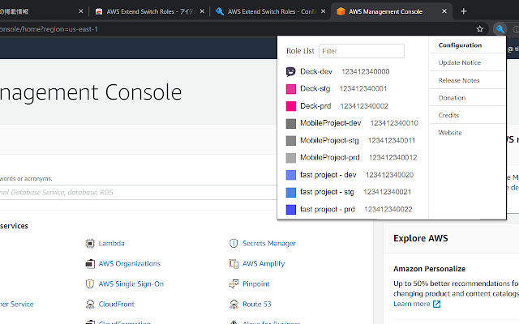

# Console AWS

## Switcher entre ses comptes AWS

Sur Chrome installer l'extention AWS Extend Switch Roles (https://chrome.google.com/webstore/detail/aws-extend-switch-roles/jpmkfafbacpgapdghgdpembnojdlgkdl?hl=en), puis copier le fichier suivant dans l'espace de configuration.

```ini
[companyName]
aws_account_id = 485429696937                                            # 485429696937 étant l'id du compte principal aws

[profile smmrgv-prod]
source_profile = companyName
role_arn = arn:aws:iam::452185648521:role/OrganizationAccountAccessRole  # 452185648521 étant l'id du compte de l'organization
```

Vous pouvez désormais changer de compte en cliquant sur l'icon de l'extention dans chrome puis en sélectionnant le compte de l'organization sur lequel vous souhaitez vous connecter.

<p align="left">
  
</p>
